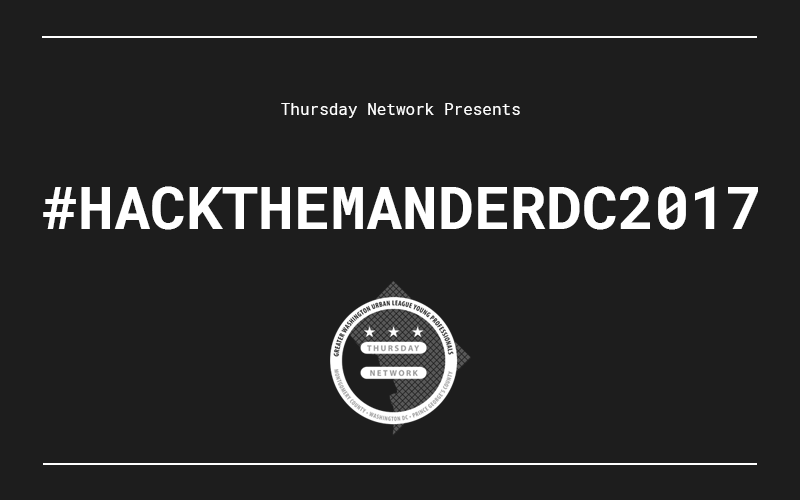

A splash page for announcing the TN Hackathon in July.

To view, simply clone this repo onto your local environment, change into this directory and open `index.html` into your web browser.

You'll notice at the lower right of the page a form for users to submit preliminary info about themselves. This information will be populated into this [Google Sheet](https://docs.google.com/spreadsheets/d/1waCq2L-3dEGzj32m7sFhT8IQiPEyiXNFC-mf5zIjtDs/edit#gid=0) which we can use to stay in contact with them as the hackathon date draws near.
